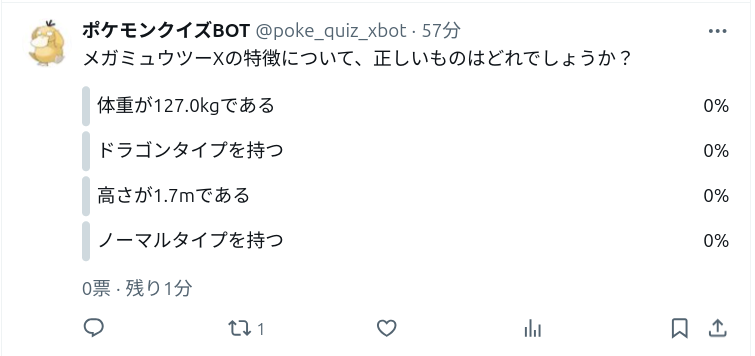
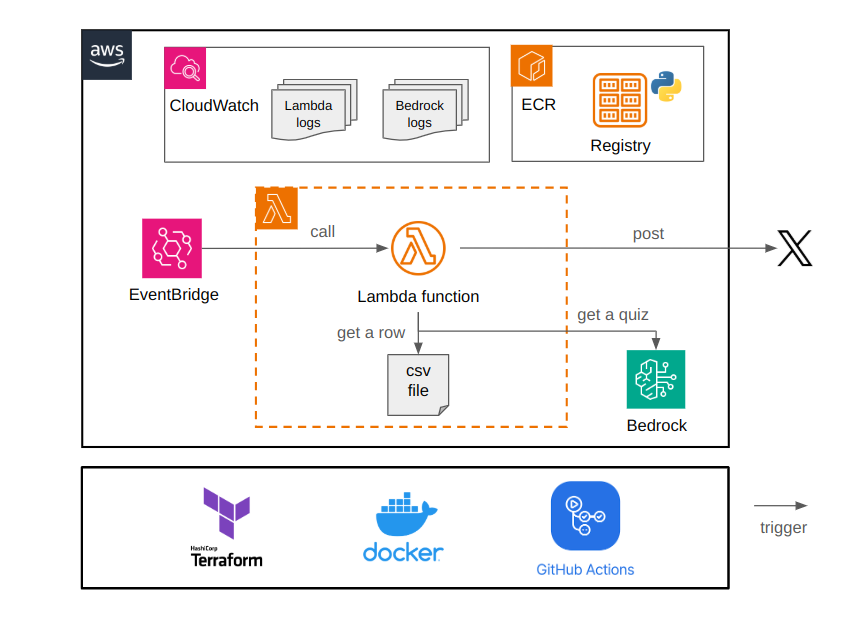

# ポケモンクイズを投稿する X (Twitter) BOT
## 概要
ポケモンクイズを X (Twitter) に投稿します

## 特徴
大規模言語モデルがポケモンのクイズを生成します

## 利用シーン
ポケモンの名前と特徴を覚えたい

## 出題例



## 導入
### 構成


### 前提
下記のサービスを利用します。

- AWS
- Terraform
- Docker

### 準備
トップディレクトリに `terraform.tfvars` を用意します。
```bash
# サービスの変数
service_name       = "pokemon-quiz-bot"
ecr_post_func_name = "ecr-post-func"

# AWS のシークレット
account_id = "[アカウント ID]"
region     = "[リージョン]"

# OpenAI のシークレット
openai_api_key = "[OpenAI の API キー]"

# X のシークレット
x_bearer_token        = "[X の BEARER トークン]"
x_api_key             = "[X の API キー]"
x_api_key_secret      = "[X の API キーシークレット]"
x_access_token        = "[X の アクセストークン]"
x_access_token_secret = "[X のアクセストークンシークレット]"
```

### デプロイ

```bash
terraform init
terraform plan
terraform apply --auto-approve
```

## TODO
- エラーハンドリングとロギング
